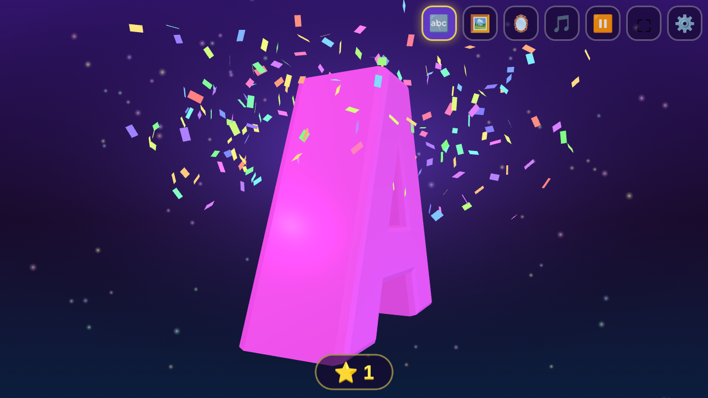
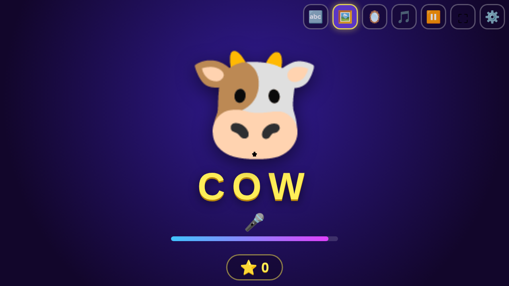
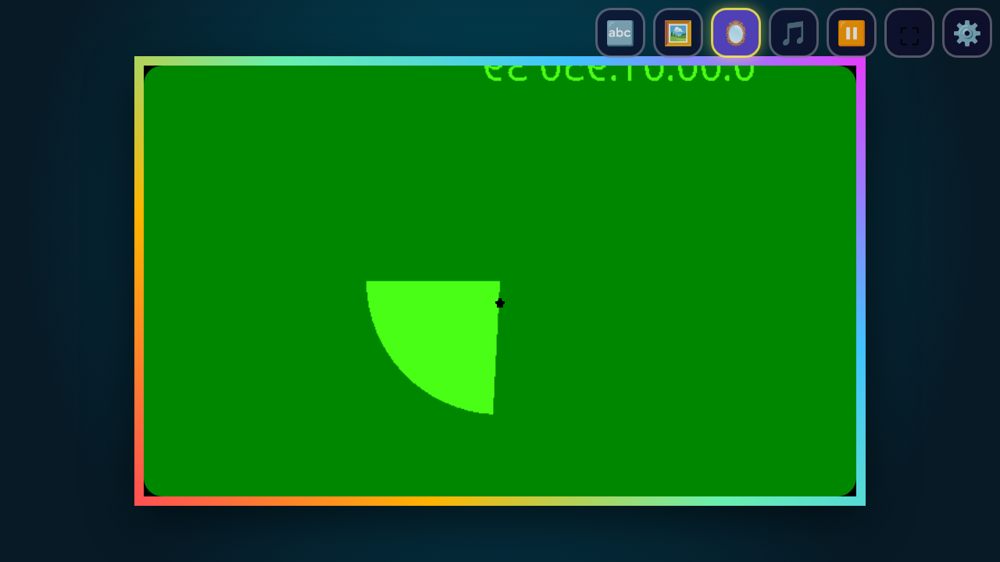
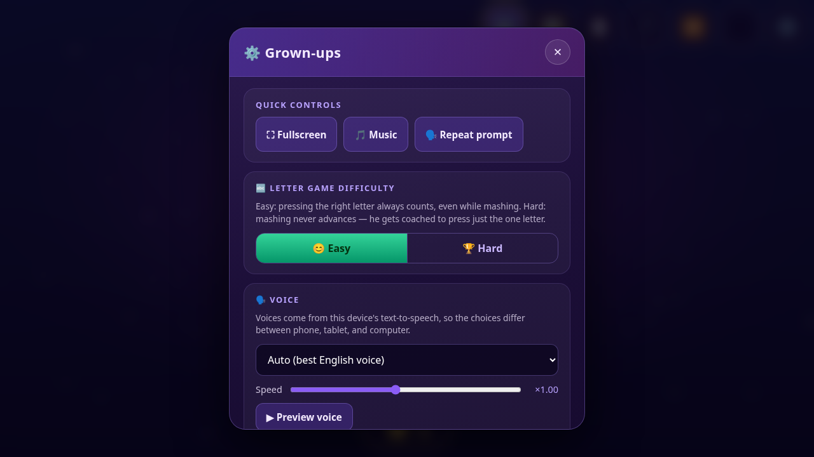
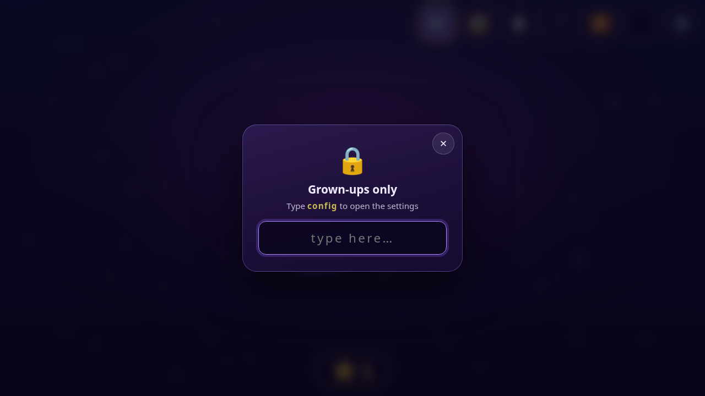
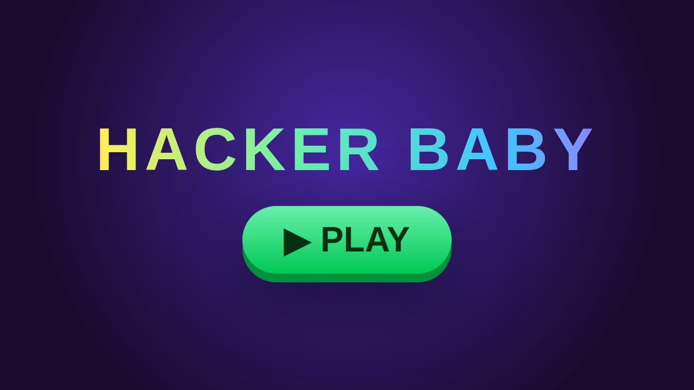
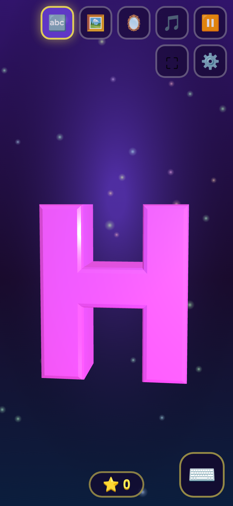

# Hacker Baby 👶⌨️

A fullscreen PWA kiosk playground for a toddler (built for a 17-month-old),
made with [three.js](https://threejs.org/) and
[PeerCompute](https://github.com/ubernaut/peercompute). It runs in Chrome,
serves over HTTPS from Vite in development, and deploys to GitHub Pages
straight from the `docs/` folder.

Everything on screen reacts to little hands: keys rain down in 3D, taps make
things spin and boing, particles chase (or flee) the pointer, and a friendly
voice cheers every win.



**Found a bug? Have an idea for a new game?**
[File an issue or feature request](https://github.com/ubernaut/hackerbaby/issues)
— they're very welcome!

---

## The games

### 🔤 Letter game (the main event)

A big colorful 3D letter floats on screen while a voice says its name and a
word the baby knows — several words per letter ("B! B is for bubble!" …
ball, banana, book, bird, bath), picked at random so prompts stay fresh.
The vocabulary is toddler-tuned: mama, dada, peekaboo, uh-oh, vroom, zoo.

- **Press the right key** → confetti explosion, a randomized happy jingle,
  "Yay! Great job!", a star on the scoreboard, and the next letter arrives
  on a brand-new scene theme.
- **Every key pressed** rains down the screen as a bright, spinning 3D
  letter with a pop sound — mashing showers the whole screen festively.
- **Mash detection**: a flurry of keys (5+ in 1.5s) plays a gentle sad
  trombone and never advances the game.
- **Two difficulties** (set in the grown-ups panel):
  - **Easy** (default) — pressing the right letter always counts, even
    mid-mash.
  - **Hard** — mashing never advances; instead a voice coaches him:
    *"Almost! Just press B!"*, *"You can do it! Just press B!"*
- If he wanders off, the letter re-prompts with a different word every few
  seconds; a hint re-prompt also fires after several wrong presses.
- On phones/tablets a **⌨️ button** summons the system on-screen keyboard so
  the game is fully playable without a physical keyboard.

### 🖼️ Picture game ("what is this?")



Shows a picture and listens with speech recognition for the baby to say the
word. Saying it (or a toddler variant — "woof", "kitty", "moo" all count)
triggers a celebration; after 30 seconds it gently says the answer and moves
on. Tapping the picture makes it hop with a boing and repeats the word.

- Ships with ~22 emoji cards seeded from the same baby vocabulary.
- **Custom photo cards** — add your own photo + word ("dada", "mama") from
  the grown-ups panel, either by uploading a file **or taking a photo with
  the camera right in the panel** (live preview, front/back flip, snap,
  retake). Cards persist in IndexedDB on the device.
- Repo-committed cards work too: drop images in `public/cards/` and list
  them in `public/cards.json`:

  ```json
  { "cards": [{ "word": "dada", "image": "./cards/dada.jpg", "alt": ["daddy", "papa"] }] }
  ```

- The app **mutes its own microphone while it speaks** (plus an echo grace
  window), so it can't hear itself say the answer and self-advance.
- No mic or no network? Cards simply auto-advance on the 30s timer.

### 🪞 Mirror



The front camera in a rainbow frame so he can look at himself. Tapping takes
a freeze-frame "photo" with a flash and shutter sound, then unfreezes.

---

## Delight everywhere

- **Tap reactions** — poke the big letter and it spins, flips, hops
  (squash & stretch), or wobbles, each with its own silly sound (slide
  whistles, boing, honk). Falling letters get kicked back up when tapped.
  Empty space puffs sparkles.
- **Sparkle trail** — a rainbow star trail follows the pointer everywhere,
  even over the picture and mirror modes.
- **Pointer-reactive particles** — some background particles are curious and
  drift toward the pointer, some are shy and scoot away.
- **Six scene themes** rotate every letter: night bubbles, ocean bubbles,
  sunset hearts, meadow fireflies, candy stars, and drifting space stars.
  The picture stage cycles its own backdrop colors per card.
- **Scores** — each game keeps a persistent ⭐ count (bottom center) with a
  happy pop animation on every win.
- **Big friendly cursor** — a chunky zero-lag native SVG cursor that
  squishes green when clicked.
- **Sound & music** — every sound effect is synthesized with WebAudio (no
  audio assets): varied success jingles, pops, boings, whooshes, a sad
  trombone, camera shutter. Background music is a soft generative
  pentatonic loop — or **your own YouTube playlist** (see below).

---

## Grown-ups panel



Three ways in (all toddler-proof):

1. Tap the **⚙️ cog** and type `config` in the box that appears (this also
   summons the on-screen keyboard on tablets),
2. open the app with **`#config`** in the URL, or
3. **long-press the top-left corner** for ~1.2 seconds.



Settings (all persisted per device):

| Setting | What it does |
| --- | --- |
| Quick controls | Fullscreen, music toggle, repeat the current voice prompt |
| Difficulty | Easy / Hard segmented switch for the letter game |
| Voice | Pick any of the device's text-to-speech voices, with instant preview |
| Speech speed | ×0.5–×1.6 slider applied to every prompt |
| Background music | Paste a YouTube playlist link/ID — plays looped & shuffled through a hidden embed, falling back to the built-in tunes offline; or clear it to use the built-in synth music |
| Custom cards | Add photo+word cards by file upload or in-panel camera capture; delete existing ones |

The panel footer links back to
[the GitHub repo](https://github.com/ubernaut/hackerbaby) for issues and
feature requests.

### Persistence

| Data | Where | Survives |
| --- | --- | --- |
| Difficulty, voice, speed, playlist, music on/off | localStorage | reloads & reboots |
| Scores for both games | localStorage | reloads & reboots |
| Custom card photos | IndexedDB | reloads & reboots |
| The app itself | Service worker cache | works offline after first visit |

The app also requests durable storage (`navigator.storage.persist()`) so the
browser won't evict any of it under disk pressure. Everything is per-device;
use `public/cards.json` for cards you want on every device.

---

## Running it

```bash
npm install
npm run dev        # HTTPS dev server on https://localhost:5199 (LAN too)
npm run build      # builds into docs/ for GitHub Pages
npm run preview    # serve the built docs locally
npm run icons      # regenerate PWA icons (pure-node PNG generator)
```

The dev cert is self-signed (generated into `certs/`, gitignored) — accept
the browser warning once. Camera and microphone require HTTPS, which is why
dev is HTTPS-only.

### Kiosk mode



Best experience is Chrome's real kiosk mode:

```bash
google-chrome --kiosk --autoplay-policy=no-user-gesture-required https://<host>/
```

The ▶ PLAY tap requests fullscreen and a screen wake lock, hides the native
cursor, and swallows keyboard input so the baby can't navigate away
(Chrome-level keys like Ctrl+W need `--kiosk` to be blocked). A boot loader
(spinning star) covers the first paint so no unstyled content ever flashes.

### Phones & tablets



Fully responsive: top-bar buttons are finger-sized, activate on
`pointerdown` (no click lag), and wrap only when the row truly runs out of
screen. The ⌨️ button brings up the system keyboard for the letter game, and
the app installs as a PWA (fullscreen, offline) from Chrome's "Add to Home
Screen".

### Deploying to GitHub Pages

`npm run build` outputs a fully relative-path site into `docs/`. In the
GitHub repo settings, set **Pages → Deploy from a branch → `main` /
`docs`**. The service worker caches the app shell for offline use (it only
registers on production builds).

---

## PeerCompute

The app boots a `NodeKernel` (`gameId: hackerbaby`, `roomId: nursery`) and
publishes live game status — current mode, letter, card, and scores —
through the shared `StateManager`, so another device on the same relay (or
NetViz) can watch him play. It loads lazily as a separate chunk and degrades
silently when no relay is reachable; the games never depend on it.

Relay bootstrap follows the same convention as the peercompute demos: drop a
`relay-config.json` next to `index.html` (or pass `?relayConfigUrl=...`).
The `@peercompute` import is a Vite alias into the sibling `../peercompute`
repo, bundled at build time.

## Speech

- Prompts use the browser's built-in SpeechSynthesis; the voice and speed
  are configurable in the grown-ups panel (voices differ per device).
- The picture game uses Chrome's SpeechRecognition, which needs network
  access. Without it (or without a mic) cards simply auto-advance.

## Contributing

Issues and feature requests are enthusiastically welcomed at
[github.com/ubernaut/hackerbaby/issues](https://github.com/ubernaut/hackerbaby/issues)
— this started as a one-baby project, but ideas from other parents make it
better for every baby.
